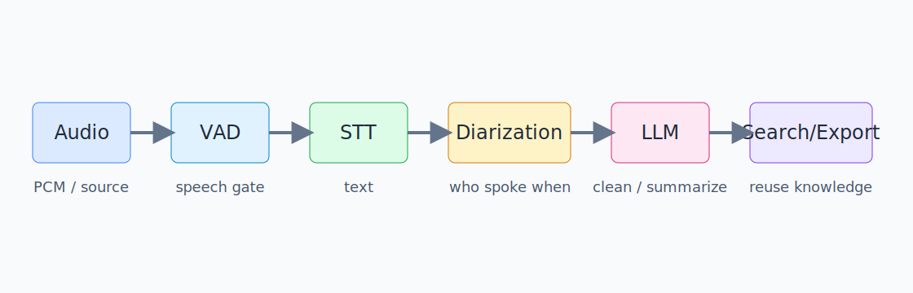
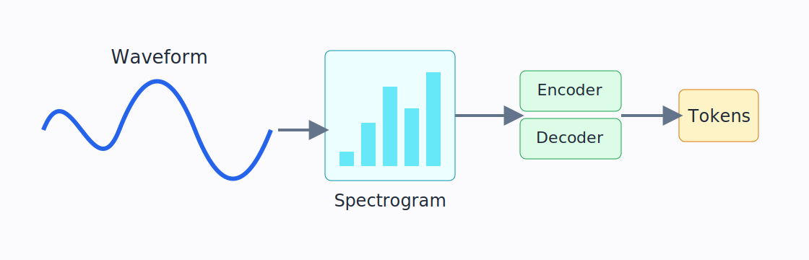
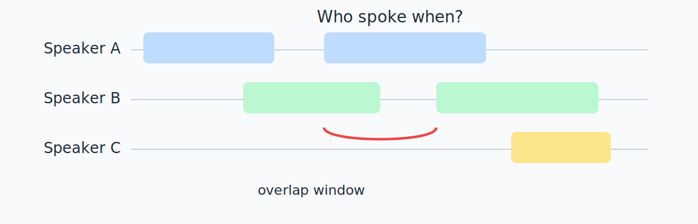
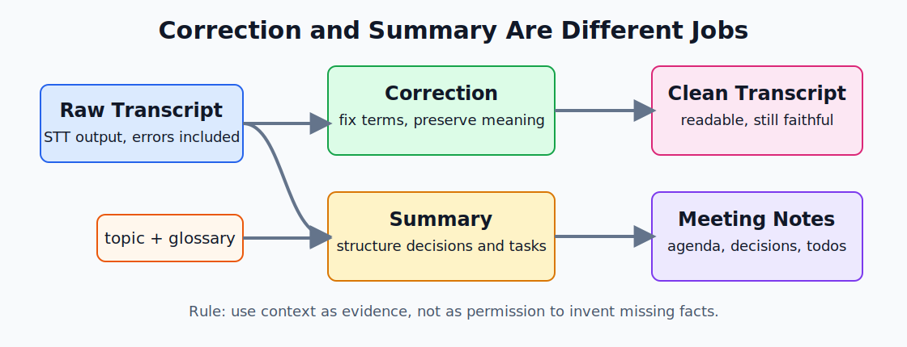
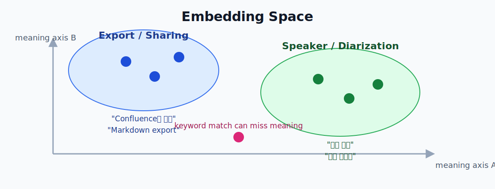
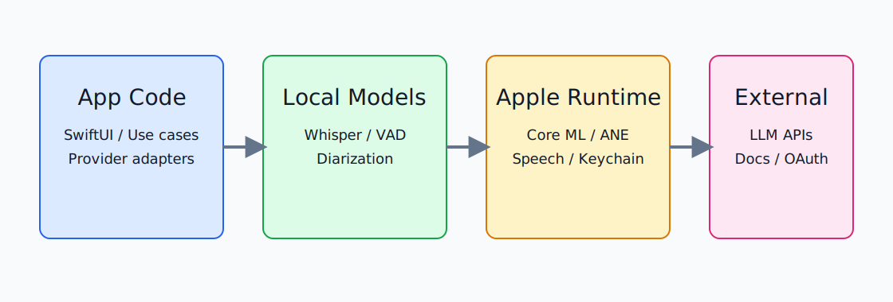

# Minto2 음성 AI 기술 복습서

부제: macOS 회의 기록 앱을 만들며 만난 STT, VAD, 화자분리, LLM, 검색, 온디바이스 런타임

작성일: 2026-06-26
정본 위치: `docs/book/minto2-speech-ai-study-book.md`
출처 매트릭스: `docs/book/source-matrix.md`

## 읽는 방법

이 책은 Minto2를 만들며 실제로 마주친 기술을 다시 복습하기 위한 문서다. 음성 AI 일반론만 설명하지 않고, "이 개념이 Minto2에서는 어떤 결정으로 이어졌는가"를 함께 적는다.

각 장에는 라벨이 있다.

| 라벨 | 뜻 |
|---|---|
| 프로젝트 로컬 | Minto2의 현재 기능, 코드, 문서에서 확인한 내용 |
| 외부 검증 | 논문, 공식 문서, 공식 repo 같은 1차 출처로 확인해야 하는 일반 기술 |
| 후보 기술 | 아직 채택 결정이 아니라, 나중에 검토할 수 있는 선택지 |

초급 개발자는 각 장의 "한눈에 보는 흐름"과 "핵심 용어"를 먼저 읽으면 된다. 중급 개발자는 비교표와 실패 모드를 보면 된다. 고급 개발자는 지표, 모델 구조, 런타임 경계, 검증 방법을 중심으로 보면 된다.

---

## 1. Minto2는 무엇을 만들고 있었나

라벨: 프로젝트 로컬

### 한눈에 보는 흐름

Minto2는 회의가 끝난 뒤 기억을 되살리는 앱이다.
마이크와 시스템 소리를 받아 텍스트로 바꾼다.
그 텍스트를 회의 문맥에 맞게 읽기 쉽게 교정하고 요약한다.
나중에는 저장된 회의를 검색하고, 근거가 있는 답변을 만든다.
핵심은 "소리 → 기록 → 지식"으로 바꾸는 흐름이다.

예를 들어 가상의 설계 리뷰 회의에서 누군가 "검색 고도화 설계는 다음 스프린트로 미루자"고 말했다고 하자. Minto2가 해야 할 일은 이 말을 단순히 받아 적는 데서 끝나지 않는다. 누가 말했는지, "검색 고도화"가 내부 용어인지, 이 문장이 결정사항인지, 나중에 어떻게 다시 찾을지까지 이어서 생각해야 한다.

### 전체 흐름

> 입력 오디오
> → PCM 변환
> → VAD로 말소리 구간 찾기
> → STT로 전사
> → 화자 라벨 붙이기
> → LLM 교정/요약
> → 저장
> → 검색/RAG/내보내기

그림 1. Minto2의 큰 흐름. 각 단계는 서로 다른 실패 모드와 검증 지표를 가진다.

Minto2의 기능 정의는 회의 중 전사, 전사 교정, 검색, 업무 문서 연결, 로컬 우선 처리를 핵심 가치로 둔다. 로컬 처리는 사용자의 음성이 외부로 나가지 않는 장점이 있지만, 모델 크기와 macOS 런타임 제약을 직접 감당해야 한다. 클라우드 LLM은 품질과 편의가 좋지만, 사용자가 어떤 데이터가 전송되는지 이해해야 한다.

### 핵심 구분

| 이름 | 의미 | 왜 중요한가 |
|---|---|---|
| 원본 전사 | STT가 처음 만든 텍스트 | CER 같은 정확도 측정의 기준 |
| 교정 전사 | LLM이나 규칙으로 읽기 좋게 다듬은 텍스트 | 회의록 품질에 중요하지만 STT 정확도와 섞으면 안 됨 |
| 요약 | 논의 내용, 결정, 할 일을 구조화한 결과 | 검색과 공유에 유용 |
| 검색 index | 나중에 찾기 좋게 쪼개고 벡터화한 데이터 | RAG 답변의 근거 |
| export 결과 | Markdown, 클립보드, Confluence 등으로 내보낸 문서 | 사용자가 실제로 공유하는 산출물 |

Minto2에서 특히 중요한 원칙은 STT 정확도와 회의록 가독성을 분리하는 것이다. STT가 틀린 글자를 얼마나 만들었는지는 CER로 본다. 회의록이 읽기 좋은지는 교정/요약 품질로 본다. 두 값을 섞으면 어떤 기술이 실제로 문제를 해결했는지 모르게 된다.

---

## 2. 소리에서 텍스트까지

라벨: 프로젝트 로컬 + 외부 검증

### 한눈에 보는 흐름

컴퓨터는 소리를 바로 "문장"으로 듣지 않는다.
처음에는 공기의 떨림을 숫자 배열로 바꾼다.
그 숫자에서 말소리 구간만 잘라낸다.
그다음 모델이 숫자 패턴을 글자나 토큰으로 바꾼다.
그래서 STT 품질은 모델만이 아니라 앞단 오디오 처리에도 크게 흔들린다.

가상의 회의실을 떠올리면 쉽다. 발표자의 목소리, 키보드 소리, 의자 끄는 소리, 에어컨 소리가 한 줄의 숫자 배열로 같이 들어온다. 좋은 전사는 이 숫자 배열에서 "사람이 말한 구간"을 먼저 잘라내고, 그 조각을 모델이 이해할 수 있는 모양으로 바꾸는 데서 시작한다.

### 오디오 처리의 기본 단어

| 용어 | 쉬운 설명 | Minto2에서의 의미 |
|---|---|---|
| PCM | 소리의 높낮이를 일정 간격으로 찍은 숫자 배열 | STT/VAD가 실제로 먹는 형태 |
| sample rate | 1초에 몇 번 소리를 찍는가 | 16kHz mono 변환은 STT 파이프라인의 흔한 입력 |
| mono | 한 채널 소리 | 모델 입력을 단순화하지만 채널별 화자 정보는 사라질 수 있음 |
| chunk | 긴 오디오를 잘라낸 조각 | 너무 짧으면 문맥이 부족하고, 너무 길면 지연이 커짐 |
| preview transcript | 녹음 중 임시로 보여주는 전사 | 빠른 피드백용 |
| final transcript | 확정 구간 전사 | 저장, 교정, 요약의 기준 |

### 왜 chunk가 중요한가

회의는 계속 흐른다. 전체 회의가 끝날 때까지 기다렸다가 전사하면 정확도는 좋아질 수 있지만, 사용자는 실시간 기록을 볼 수 없다. 반대로 1초마다 전사하면 빠르지만 문장이 잘리고 모델 문맥이 부족해진다.

그래서 실시간 회의 앱은 보통 다음 절충을 한다.

| 전략 | 장점 | 단점 |
|---|---|---|
| 짧은 chunk | 화면 반응이 빠름 | 문맥 부족, 단어 누락 가능 |
| 긴 chunk | 문맥이 많고 문장이 자연스러움 | 지연 증가, 메모리/연산 증가 |
| preview/final 분리 | 빠른 표시와 안정 저장을 둘 다 노림 | 상태 관리가 복잡해짐 |

Minto2는 preview와 final의 역할을 분리한다. preview는 녹음 중 사용자의 불안을 줄이는 UI 신호이고, final은 저장·교정·요약으로 이어지는 신뢰 구간이다.

---

## 3. STT/ASR 기본 원리

라벨: 외부 검증

### 한눈에 보는 흐름

ASR은 "소리 그림을 보고 글자를 맞히는 모델"이라고 보면 된다.
소리는 먼저 spectrogram 같은 시간-주파수 그림으로 바뀐다.
신경망은 그 그림에서 말소리 패턴을 찾는다.
마지막에는 글자, subword, token 같은 출력 단위로 문장을 만든다.
모델 계열에 따라 CTC, RNN-T, encoder-decoder, attention 같은 방식이 달라진다.

비유하면 ASR 모델은 처음부터 한국어 문장을 아는 속기사가 아니다. 수많은 음성 예시로 학습한 뒤, 새 회의 소리가 들어오면 "이 소리 그림 다음에는 어떤 글자나 token이 가장 그럴듯한가"를 계산하는 함수에 가깝다.

### STT와 ASR

STT는 speech-to-text의 줄임말이고, ASR은 automatic speech recognition의 줄임말이다. 실무에서는 비슷하게 쓰지만, ASR이 연구/모델 쪽 용어에 가깝고 STT가 제품 기능명에 가깝다.

### 소리를 모델이 보기 좋은 형태로 바꾸기

사람은 시간에 따라 바뀌는 압력 변화를 소리로 듣는다. 모델은 보통 이 값을 그대로 쓰지 않고, 주파수별 에너지로 바꾼다.

> waveform
> → frame 단위로 자르기
> → Fourier transform
> → mel filterbank
> → log-mel spectrogram
> → encoder 입력

그림 2. 소리는 바로 글자가 되지 않고, 주파수 특징과 신경망 단계를 거쳐 token으로 바뀐다.

mel spectrogram은 "낮은 주파수는 촘촘히, 높은 주파수는 상대적으로 성기게" 보는 인간 청각 감각을 반영한다. Whisper 같은 모델도 이런 log-mel 입력을 사용한다.

여기서 신경망은 숫자 입력을 숫자 출력으로 바꾸는 큰 함수다. 학습은 정답 데이터로 이 함수의 weight를 조정하는 과정이고, 추론은 학습된 weight로 새 입력의 결과를 계산하는 과정이다. Minto2 같은 앱은 보통 모델을 직접 학습하지 않고, 이미 학습된 모델을 가져와 추론을 빠르고 안정적으로 돌리는 쪽에 집중한다.

| 구분 | 뜻 | 제품에서 중요한 점 |
|---|---|---|
| 학습 | 정답 데이터로 weight를 조정 | 보통 앱 안에서 하지 않음 |
| fine-tuning | 기존 모델을 특정 데이터에 맞게 추가 학습 | 개인정보/비용/평가 필요 |
| 추론 | 학습된 모델로 결과 계산 | 앱 성능과 UX에 직접 영향 |
| quantization | weight나 activation 정밀도를 낮춰 가볍게 만듦 | 속도/메모리 개선, 정확도 저하 가능 |

### 주요 모델 구조

| 구조 | 핵심 아이디어 | 장점 | 약점 |
|---|---|---|---|
| CTC | 입력 frame과 출력 글자 정렬을 모델이 암묵적으로 학습 | 빠르고 단순함 | 긴 문맥, punctuation, 복잡한 언어 모델링이 약할 수 있음 |
| RNN-T | streaming에 맞게 acoustic encoder와 prediction network를 결합 | 실시간 ASR에 강함 | 구현과 튜닝이 복잡 |
| Encoder-decoder | encoder가 소리를 요약하고 decoder가 token을 생성 | 문맥과 다국어 처리에 강함 | streaming 지연이 생기기 쉬움 |
| Transformer/Attention | 중요한 시간 구간에 가중치를 주며 전체 문맥을 본다 | 긴 문맥과 대규모 학습에 강함 | 계산량과 메모리 부담 |

attention은 입력 중 어디를 더 볼지 정하는 장치다. 음성에서는 특정 시간 구간이 어떤 token 생성에 중요한지 볼 수 있고, LLM에서는 앞 문맥 중 어떤 token이 다음 token에 중요한지 본다. 쉽게 말하면 책상 위 자료 중 지금 답하는 데 중요한 페이지에 손가락을 올리는 행동에 가깝다.

### Whisper 계열

Whisper는 OpenAI의 대규모 약지도 학습 ASR 모델이다. 논문은 다양한 언어와 작업을 하나의 sequence-to-sequence 모델로 다루는 방향을 제시한다. Whisper가 강한 이유는 단순히 모델 구조만이 아니라, 매우 큰 학습 데이터와 다국어/멀티태스크 학습에 있다.

Minto2에서 WhisperKit은 Whisper 계열 모델을 Apple 플랫폼에서 돌리기 위한 실용 경로다. 즉 Whisper는 모델/연구 계열 이름이고, WhisperKit은 Apple Silicon 앱에서 쓰기 위한 구현/런타임 계층으로 봐야 한다.

### Minto2에서의 의미

STT 엔진을 고를 때 "정확도"만 보면 부족하다. 회의 앱은 다음 조건을 함께 봐야 한다.

| 조건 | 질문 |
|---|---|
| CER | 한국어 글자 오류가 얼마나 적은가 |
| RTF | 1초 음성을 몇 초에 처리하는가 |
| streaming | 녹음 중 바로 쓸 수 있는가 |
| hallucination | 조용한 구간이나 애매한 발화에서 없는 말을 만들지 않는가 |
| on-device | 네트워크 없이 Mac에서 돌 수 있는가 |
| 메모리/발열 | 장시간 회의에서 버틸 수 있는가 |

---

## 4. Minto2의 STT 후보들

라벨: 프로젝트 로컬 + 후보 기술

### 한눈에 보는 흐름

STT 엔진 선택은 "가장 유명한 모델"을 고르는 일이 아니다.
한국어 회의, macOS, 실시간성, 로컬 처리, 메모리, 비용을 동시에 본다.
WhisperKit은 현재 실용적인 로컬 경로다.
Apple Speech 계열은 시스템 통합이 강하지만 OS availability 확인이 필요하다.
Qwen3-ASR, sherpa-onnx, MLX/ONNX 계열은 후보로 계속 볼 가치가 있다.

예를 들어 데모 영상에서 빠르게 보이는 모델이 있어도, 한국어 회의에서 90분 동안 발열 없이 돌아가고, 첫 실행 모델 다운로드와 권한 흐름까지 앱 안에서 설명할 수 있어야 제품 후보가 된다.

### 후보 비교

| 후보 | 분류 | 강점 | 주의점 |
|---|---|---|---|
| WhisperKit | Apple 플랫폼 Whisper 런타임 | 로컬 실행, Swift 통합 | 모델 크기와 Core ML 변환/런타임 이슈 |
| Apple Speech/SFSpeechRecognizer | Apple 시스템 API | OS 통합, 앱 크기 부담 감소 가능 | 언어/OS availability와 정책 확인 필요 |
| SpeechAnalyzer/SpeechTranscriber | Apple 신규 Speech 계열 | 장형식/원거리 오디오 가능성 | 현재 SDK availability를 직접 확인해야 함 |
| Qwen3-ASR | 후보 ASR 모델 | 한국어 포함 다국어, 작은 모델군, streaming 주장 | 논문/repo/모델카드 최신 상태와 한국어 CER 직접 측정 필요 |
| sherpa-onnx | ONNX 기반 speech toolkit | STT, VAD, diarization 등 폭넓은 기능 | CPU/ONNX 성능과 모델별 언어 품질을 따로 봐야 함 |
| whisper.cpp | GGML/로컬 Whisper 경로 | 넓은 플랫폼, Core ML encoder 가속 가능 | Swift 앱 통합과 디코더 성능 제약 |
| MLX 계열 | Apple silicon 친화 런타임 | 실험과 고속 추론 후보 | 앱 배포/호환성/모델 변환 확인 필요 |

### CER, WER, RTF

| 지표 | 뜻 | 주의 |
|---|---|---|
| CER | character error rate, 글자 오류율 | 한국어 평가에 더 적합한 편 |
| WER | word error rate, 단어 오류율 | 한국어는 띄어쓰기 기준이 흔들려 직접 비교가 어렵다 |
| RTF | real-time factor | RTF 0.5는 1초 음성을 0.5초에 처리한다는 뜻 |

한국어 회의 앱에서는 CER을 중심으로 보되, 실제 제품성은 RTF와 안정성까지 함께 봐야 한다. WER 2%와 CER 2%는 같은 뜻이 아니다. 데이터셋도 다르면 비교가 더 위험하다.

### Minto2에서의 의미

Minto2는 로컬 우선 앱이므로 "on-device 가능"을 세 단계로 나누어 봐야 한다.

1. 모델이 공개되어 있다.
2. Apple Silicon에서 실행되는 변환본이나 런타임이 있다.
3. Minto2 회의 파이프라인에서 한국어 회의가 실시간으로 안정 동작한다.

1번과 2번은 후보 조건이고, 3번이 채택 조건이다.

---

## 5. VAD와 chunking

라벨: 프로젝트 로컬 + 외부 검증

### 한눈에 보는 흐름

VAD는 "지금 말하고 있나?"를 판단하는 문지기다.
문지기가 너무 예민하면 잡음도 말로 착각한다.
너무 둔하면 작은 목소리나 첫 음절을 놓친다.
STT 모델이 좋아도 VAD가 구간을 잘못 자르면 결과가 흔들린다.
그래서 VAD는 작지만 회의 앱 품질에 큰 영향을 준다.

가상의 회의에서 누군가 "민토 배포는 금요일"이라고 말했는데 VAD가 앞의 "민"을 잘라버리면, 뒤의 STT와 LLM은 이미 불리한 게임을 시작한다. 그래서 VAD는 작은 전처리처럼 보여도 뒤 단계 전체의 품질을 좌우한다.

### VAD 방식

| 방식 | 쉬운 설명 | 장점 | 단점 |
|---|---|---|---|
| energy VAD | 소리 에너지가 threshold보다 큰지 본다 | 단순하고 빠름 | 환경 잡음에 약함 |
| WebRTC VAD | 전통적인 음성 특징 기반 VAD | 가볍고 실시간에 적합 | 모델 기반 VAD보다 복잡한 상황에 약할 수 있음 |
| Silero VAD | 작은 신경망 기반 VAD | 다양한 환경에 강한 편 | 모델 로딩과 런타임 관리 필요 |

### 실패 모드

| 실패 | 증상 | 결과 |
|---|---|---|
| 앞부분 잘림 | 첫 음절 누락 | 사람 이름, 전문용어가 틀어짐 |
| 뒷부분 잘림 | 문장 끝 누락 | 요약/교정에서 문맥 손실 |
| 잡음 오탐 | 키보드, 의자 소리 전사 | hallucination 증가 |
| 긴 침묵 포함 | chunk가 불필요하게 길어짐 | 지연 증가 |
| 너무 잦은 분할 | 문장 단위가 깨짐 | STT와 LLM 교정 품질 저하 |

### Minto2에서의 의미

Minto2에서는 preview/final 분리가 있기 때문에 VAD 결과가 UI 상태와 저장 상태에 모두 영향을 준다. 녹음 중에는 빠른 표시가 중요하고, 저장 전에는 누락 없는 final transcript가 중요하다. 따라서 VAD는 단순한 전처리가 아니라 제품 경험의 일부다.

---

## 6. 화자분리

라벨: 프로젝트 로컬 + 외부 검증

### 한눈에 보는 흐름

화자분리는 "누가 언제 말했나"를 맞히는 일이다.
STT는 보통 "무슨 말을 했나"를 맞힌다.
회의록은 둘 다 필요하다.
실시간 화면에서는 빠른 임시 라벨이 중요하고, 저장 후 기록에서는 더 정확한 확정 라벨이 중요하다.
그래서 Minto2는 live와 offline 역할을 구분한다.

예를 들어 같은 문장이라도 팀장이 "그건 하지 맙시다"라고 말한 것과 질문자가 "그건 하지 말자는 뜻인가요?"라고 말한 것은 회의록에서 전혀 다르다. 화자분리는 텍스트의 의미를 바꾸는 배경 정보다.

### 핵심 용어

| 용어 | 뜻 |
|---|---|
| diarization | 오디오 timeline을 화자별 구간으로 나누는 작업 |
| speaker embedding | 목소리 특징을 숫자 벡터로 표현한 것 |
| DER | diarization error rate, 화자분리 오류율 |
| RTTM | 화자분리 정답/결과를 표현하는 표준 포맷 중 하나 |
| overlap | 여러 사람이 동시에 말하는 구간 |
| clustering | 비슷한 목소리 구간을 같은 화자로 묶는 과정 |

그림 3. 화자분리는 텍스트 생성이 아니라 시간 구간과 화자 활동을 맞히는 문제다.

### EEND 계열

EEND는 end-to-end neural diarization의 줄임말이다. 전통적인 diarization은 음성 구간을 자르고, embedding을 만들고, clustering을 하는 여러 단계를 거친다. EEND는 이 문제를 신경망이 직접 speaker activity를 예측하는 문제로 바꾼다.

> 오디오 특징
> → neural encoder
> → 시간별 speaker activity matrix
> → speaker label timeline

EEND의 중요한 장점은 overlap을 자연스럽게 표현할 수 있다는 점이다. 한 시간 구간에 speaker A와 speaker B가 동시에 켜질 수 있기 때문이다.

LS-EEND는 long-form streaming 상황을 다루기 위한 EEND 계열이다. 긴 회의에서 speaker가 계속 등장하고 사라지는 상황을 처리하려면, 짧은 녹음 하나만 보는 모델보다 streaming과 memory 설계가 중요하다.

speaker embedding은 목소리 특징을 벡터 공간에 놓는 방법이다. 텍스트 embedding이 의미가 비슷한 문장을 가까이 놓는다면, speaker embedding은 목소리 특징이 비슷한 발화를 가까이 놓는다. 두 embedding은 모두 벡터지만 비교하는 대상이 다르다. 텍스트 embedding으로 같은 화자를 찾을 수 없고, speaker embedding으로 회의 주제를 검색할 수 없다.

### VBx와 pyannote

VBx는 EEND와 같은 축이 아니다. VBx는 x-vector sequence를 Bayesian HMM clustering으로 묶는 방식이다. 저장 후 전체 오디오를 다시 보고 최종 화자 라벨을 정하는 offline 경로에 잘 맞는다.

pyannote.audio는 speaker diarization을 위한 neural building block과 pipeline 생태계다. SpeakerKit이나 FluidAudio 같은 제품/SDK 경로는 이 연구/모델 계열을 Apple 플랫폼이나 앱 통합 관점에서 포장한 계층으로 이해해야 한다.

### live와 offline을 섞지 않기

| 상황 | 필요한 성질 | 적합한 방향 |
|---|---|---|
| 녹음 중 화면 | 빠른 반응, fail-soft | streaming diarization, channel hint |
| 저장 시 확정 | 정확도, 전체 문맥 | offline VBx/pyannote 계열 |
| 회의 간 기억 | 같은 사람 재식별 | voiceprint/embedding matching |

### Minto2에서의 의미

Minto2의 화자분리는 "녹음 중 임시 라벨"과 "저장 시 확정 라벨"을 분리해서 생각해야 한다. 사용자가 보는 live 라벨은 경험을 좋게 만드는 신호이고, 저장 후 라벨은 기록의 정확성을 책임진다. 사용자가 직접 고친 라벨은 자동 재조정이 덮어쓰지 않아야 한다.

---

## 7. 보이스프린트와 화자 기억

라벨: 프로젝트 로컬

### 한눈에 보는 흐름

보이스프린트는 목소리의 지문처럼 쓰는 숫자 벡터다.
같은 사람의 목소리는 비슷한 위치에 모이기를 기대한다.
회의가 바뀌어도 같은 사람을 알아보려면 이 벡터를 비교한다.
하지만 목소리는 마이크, 방, 감기, 소음에 따라 달라진다.
그래서 자동 매칭은 항상 확률적이고, 사용자가 고칠 수 있어야 한다.

비유하면 보이스프린트는 사람 이름표가 아니라 "이 목소리가 전에 들은 목소리와 얼마나 닮았는가"를 보는 지도 좌표다. 이름표처럼 확정하면 위험하고, 후보 추천처럼 다루면 유용하다.

### 기본 흐름

> 등록된 발화 구간
> → speaker embedding 추출
> → 사람별 centroid 계산
> → 새 회의 speaker embedding과 거리 비교
> → threshold 이상이면 같은 사람 후보
> → 사용자가 확인하거나 수정

### threshold의 의미

threshold는 "얼마나 비슷해야 같은 사람으로 볼 것인가"의 기준이다.

| threshold | 결과 |
|---|---|
| 너무 낮음 | 다른 사람을 같은 사람으로 착각 |
| 너무 높음 | 같은 사람도 못 알아봄 |
| 적절함 | 자동 후보를 주되 사용자가 수정 가능 |

### 개인정보 관점

보이스프린트는 원본 음성보다 작고 추상화된 벡터지만, 여전히 개인을 식별하는 데 쓰일 수 있다. 따라서 저장 위치, 삭제 기능, 외부 전송 여부, 로그 노출 금지가 중요하다. Minto2의 로컬 우선 원칙은 보이스프린트에도 그대로 적용된다.

---

## 8. 교정과 요약

라벨: 프로젝트 로컬 + 외부 검증

### 한눈에 보는 흐름

STT는 소리를 글자로 바꾸지만, 회의록을 바로 만들지는 못한다.
회의록은 문맥, 용어, 화자, 결정사항을 알아야 읽기 좋다.
LLM은 틀린 용어를 고치고, 길게 흩어진 대화를 구조화하는 데 도움이 된다.
하지만 LLM은 입력에 없는 내용을 만들 수 있다.
그래서 교정과 요약은 "참고자료를 주되, 근거 없는 생성은 막는" 설계가 필요하다.

예를 들어 가상의 회의에서 STT가 "검색고도화"를 "검색 고도화"로 띄어 적거나 "서치 고도화"처럼 흔들리게 적을 수 있다. 교정은 이런 표현을 회의 문맥과 용어집에 맞춰 정리한다. 반대로 요약은 여러 발화를 읽고 "결정사항: 검색 고도화 설계는 다음 스프린트로 이동"처럼 구조를 만든다.

그림 5. 교정은 문장 수준의 오류를 줄이고, 요약은 회의 구조를 만든다. 둘 다 참고자료를 쓰지만, 없는 사실을 만들면 안 된다.

### 교정과 요약은 다르다

| 작업 | 입력 | 출력 | 실패 |
|---|---|---|---|
| 교정 | 원본 전사 + 회의 주제 + 용어집 | 더 읽기 좋은 전사 | 없는 말을 추가하거나 의미를 바꿈 |
| 요약 | 전사/교정 전사 + 문맥 | 목차, 내용, 결정, 할 일 | 중요한 논의 누락, 근거 없는 결론 |
| 검색 답변 | 검색된 chunk + 질문 | 근거 기반 답변 | 검색되지 않은 내용을 아는 척함 |

교정은 보통 "이미 있는 문장을 더 정확하고 읽기 쉽게 바꾸는 일"에 가깝다. 예를 들어 STT가 내부 프로젝트명을 비슷한 일반 단어로 잘못 적었을 때, 회의 주제와 용어집을 보고 원래 단어로 되돌린다. 이때 좋은 교정은 문장의 뜻을 보존한다.

요약은 "긴 대화에서 구조를 뽑는 일"이다. 결정사항, 할 일, 미해결 질문, 논의 배경을 나누어 적는다. 좋은 요약은 짧기만 한 문서가 아니라, 나중에 회의에 없던 사람이 읽어도 흐름을 따라갈 수 있는 문서다.

검색 답변은 또 다르다. 저장된 회의 중 관련 chunk를 찾고, 그 chunk 안에서만 답해야 한다. 요약 모델처럼 전체 회의를 자유롭게 정리하는 것이 아니라, 질문에 대한 근거를 좁혀서 답한다.

LLM은 문장을 한 번에 만들지 않는다. token이라는 조각 단위로 다음 token 확률을 계산한다. logits는 softmax 전 점수이고, temperature는 확률분포를 얼마나 날카롭게 또는 부드럽게 만들지 조절한다. 회의록 교정에서는 창의성이 높은 출력보다 안정적이고 근거 있는 출력이 중요하다. temperature를 높여 다양한 표현을 만들기보다, 의미 보존과 형식 안정성을 우선한다.

### 용어집과 문맥

회의에는 일반 모델이 모르는 단어가 많다. 제품명, 팀명, 약어, 내부 프로젝트명은 STT가 쉽게 틀린다. 용어집은 이런 단어를 모델에게 "이 회의에서는 이런 단어가 나올 수 있다"고 알려주는 참고자료다.

주의할 점은 용어집이 명령이 아니라 참고자료라는 것이다. 전체 용어집을 매번 다 넣으면 token 비용이 늘고, 관련 없는 단어가 오히려 교정을 흔들 수 있다. 그래서 관련 용어를 선별하고, 직접 입력한 이번 회의 용어와 전역 용어집을 구분해야 한다.

### provider 경계

LLM provider는 크게 세 경로로 나뉜다.

| 경로 | 예 | 데이터 경계 | 인증/과금 경계 |
|---|---|---|---|
| API provider | OpenAI, Anthropic, Gemini API | 선택한 외부 API로 전송 | 앱 설정/Keychain의 API key |
| 로컬 LLM | Ollama 등 | 기기 안 또는 로컬 네트워크 | 로컬 모델/서버 상태 |
| 명시적 CLI 로그인 경로 | 사용자가 선택한 로컬 CLI 로그인 재사용 | CLI가 연결하는 외부 서비스로 전송될 수 있음 | CLI 로그인/구독 경로 |

중요한 것은 사용자가 어떤 경로를 선택했는지 명확히 보여주는 것이다. "로컬 CLI를 쓰는 줄 알았는데 환경변수 API key로 과금됐다" 같은 혼동은 막아야 한다. API provider와 CLI 로그인 provider는 둘 다 Claude 계열을 쓸 수 있어도 인증과 과금 경계가 다르다.

### Minto2에서의 의미

교정과 요약은 fail-soft여야 한다. 교정이 실패해도 원본 전사와 저장은 망가지면 안 된다. 요약이 실패해도 회의 기록은 남아야 한다. 또 로그에는 전사 원문, 프롬프트, 토큰, 정상 API 응답 본문이 남으면 안 된다.

---

## 9. 검색과 답변 생성

라벨: 프로젝트 로컬 + 외부 검증

### 한눈에 보는 흐름

검색은 "어디에 관련 내용이 있었나"를 찾는 일이다.
답변 생성은 찾은 근거를 읽고 문장으로 말해주는 일이다.
둘을 섞으면 모델이 근거 없이 아는 척할 수 있다.
그래서 먼저 검색하고, 그 결과 chunk만 LLM에 준다.
답변에는 어떤 회의, 어떤 시간, 어떤 섹션이 근거인지 보여줘야 한다.

가상의 사용자가 "지난번에 Confluence 내보내기는 누가 맡기로 했지?"라고 묻는다고 하자. 좋은 검색 답변은 그럴듯한 담당자를 추측하지 않고, 관련 회의 chunk를 찾은 뒤 그 안에 적힌 사람과 시간을 같이 보여준다.

### keyword search와 semantic search

| 방식 | 잘하는 일 | 약한 일 |
|---|---|---|
| keyword search | 정확한 단어, 이름, 코드명 찾기 | 표현이 다르면 못 찾음 |
| semantic search | 의미가 비슷한 문장 찾기 | 고유명사나 숫자에 약할 수 있음 |
| hybrid | 둘의 장점 조합 | scoring과 중복 제거가 필요 |

### RAG

RAG는 retrieval-augmented generation의 줄임말이다. LLM 자체 기억만 믿지 않고, 외부 문서나 검색 index에서 관련 근거를 가져와 답변 생성에 붙이는 방식이다.

> 질문
> → keyword/embedding 검색
> → 관련 chunk 선택
> → LLM에 질문 + chunk 전달
> → 답변 + 출처 표시

### embedding

embedding은 텍스트를 숫자 좌표로 바꾸는 과정이다. 여기서 좌표는 2차원 지도처럼 눈에 보이는 x, y만 있는 것이 아니라 수백 개 또는 수천 개의 축을 가진 벡터다. 모델은 문장의 의미, 주제, 표현 패턴을 이 벡터 안에 압축한다.

그림 6. embedding은 문장을 의미 공간의 점으로 놓는다. 가까운 점은 비슷한 의미일 가능성이 높다.

예를 들어 "회의록 내보내기", "Confluence로 공유", "Markdown export"는 단어가 완전히 같지 않아도 업무 문서 공유라는 의미가 비슷하다. embedding 검색은 이런 문장들을 가까운 벡터로 놓고, 질문 벡터와 가까운 회의 chunk를 찾는다.

중요한 점은 embedding이 "정답"이 아니라 "의미상 가까울 가능성"이라는 것이다. 고유명사, 숫자, 날짜, 짧은 약어는 keyword search가 더 잘 찾을 때가 많다. 그래서 회의 검색에서는 keyword search와 semantic search를 함께 쓰는 hybrid 접근이 실용적이다.

| 개념 | 쉬운 설명 | Minto2에서의 주의 |
|---|---|---|
| vector | 문장을 숫자 배열로 표현한 것 | 모델이 바뀌면 숫자 의미도 바뀐다 |
| dimension | 벡터의 축 개수 | 차원이 높다고 항상 좋은 것은 아니다 |
| cosine similarity | 방향이 얼마나 비슷한지 보는 거리 | 길이보다 의미 방향을 보는 데 자주 쓴다 |
| chunk | 검색 단위로 자른 텍스트 조각 | 너무 크면 근거가 흐려지고, 너무 작으면 문맥이 부족하다 |
| embedding index | 벡터를 빠르게 찾기 위한 저장 구조 | 원문, 시간, 회의 ID 같은 metadata와 함께 관리해야 한다 |

그래서 embedding 검색은 모델명만 고르는 문제가 아니다. 어떤 텍스트를 chunk로 만들지, 어떤 embedding 모델을 쓸지, cosine similarity나 다른 거리 함수를 쓸지, keyword 결과와 어떻게 합칠지까지 함께 설계해야 한다.

### Minto2에서의 의미

Minto2의 검색 답변은 근거 회의, 섹션, 시간 정보를 보여줘야 한다. 회의 기록 앱에서 중요한 것은 "그럴듯한 답변"보다 "다시 확인할 수 있는 답변"이다.

---

## 10. macOS 앱으로 만들 때의 시스템 설계

라벨: 프로젝트 로컬

### 한눈에 보는 흐름

음성 AI 앱은 모델만 붙이면 끝나지 않는다.
마이크 권한, 시스템 오디오, 파일 변환, Keychain, 모델 캐시, UI 상태가 모두 얽힌다.
긴 회의에서는 발열, 메모리, 배터리도 제품 품질이다.
SwiftUI는 화면을 만들고, AppKit은 macOS 생명주기와 권한 흐름에서 자주 필요하다.
그래서 경계를 나누지 않으면 UI가 provider 요청과 저장 변환까지 떠안게 된다.

비유하면 macOS 앱의 AI 기능은 모델 하나를 책상 위에 올리는 일이 아니라, 회의실 전원, 녹음기, 보관함, 외부 전달함을 함께 배치하는 일이다. 추론이 빨라도 권한 안내가 막히거나 Keychain 접근이 흔들리면 사용자는 기능이 망가졌다고 느낀다.

### Minto2의 경계

> Domain/Core
> ← Application/Use-case
> ← Infrastructure/Adapter
> ← UI

| 층 | 책임 |
|---|---|
| Domain/Core | 전사 정규화, 용어 매칭, 검색 scoring, export 변환 규칙 |
| Application/Use-case | 전사, 교정, 요약, 검색, 내보내기 흐름 |
| Infrastructure/Adapter | LLM provider, Confluence, Notion, Keychain, 파일 변환, embedding backend |
| UI | 상태 표시와 사용자 명령 전달 |

UI가 prompt를 직접 만들거나 provider request를 직접 조립하면, 나중에 provider가 늘어날 때 화면 코드가 깨진다. 반대로 provider adapter에 domain rule을 넣으면 테스트와 재사용이 어려워진다.

### macOS에서 특히 조심할 것

| 영역 | 주의 |
|---|---|
| 오디오 권한 | 마이크, 시스템 오디오 권한 상태를 UI에 명확히 보여줘야 함 |
| Keychain | dev 실행과 서명 상태에 따라 접근 prompt가 달라질 수 있음 |
| Core ML/ANE | 모델 로딩과 런타임 호환성 확인이 STT에 영향 |
| 장시간 회의 | 모델 캐시, 메모리, 발열, 백그라운드 상태 |
| 파일 import | sample rate, channel, container 변환 실패 처리 |

그림 4. 앱 코드, Apple 런타임, 로컬 모델, 외부 provider의 경계를 나눠야 디버깅과 개인정보 설명이 쉬워진다.

---

## 11. 다음 기술을 고를 때 보는 기준

라벨: 후보 기술

### 한눈에 보는 흐름

여기까지 읽었다면 새 기술을 볼 때 질문이 달라진다.
후보 기술은 "좋아 보인다"와 "우리 앱에 맞다"가 다르다.
모델이 공개되어도 Swift 앱에서 안정적으로 돌지 않을 수 있다.
영어 성능이 좋아도 한국어 회의에는 약할 수 있다.
벤치마크가 좋아도 지표와 데이터셋이 다르면 비교할 수 없다.
그래서 후보는 항상 채택 조건과 함께 기록해야 한다.

예를 들어 새 ASR 모델이 "다국어 성능 최고"라고 소개되어도, Minto2 관점에서는 한국어 회의 CER, 1-2시간 회의 RTF, Apple Silicon 실행 경로, 개인정보 경계, 라이선스를 다시 묻는다. 앞 장에서 배운 기준은 바로 이 질문을 만들기 위한 도구다.

### 후보 목록

| 후보 | 볼 이유 | 채택 전 확인 |
|---|---|---|
| Qwen3-ASR | 한국어 포함 다국어 소형 ASR 후보 | 한국어 회의 CER, streaming 안정성, CoreML/MLX 경로 |
| sherpa-onnx | ONNX 기반 STT/VAD/diarization toolkit | macOS 성능, 모델별 한국어 품질, Swift 통합 비용 |
| mlx-audio-swift | MLX 기반 Apple Silicon speech runtime 후보 | OS 요구사항, 배포 안정성, 모델 지원 |
| whisper.cpp | 경량 로컬 Whisper 생태계 | Swift 통합, Core ML encoder만 가속되는 구조 |
| SpeakerKit | Apple Silicon diarization SDK 후보 | DER 실측, 라이선스, 새 dependency ADR |
| pyannote.audio | diarization 연구/파이프라인 기준점 | 클라우드/로컬 경로, 라이선스, 성능 |
| speakrs | CoreML diarization 후보 | self-reported 수치 독립 재현 |
| Parakeet | 빠른 ASR 계열 후보 | 한국어 지원 모델과 Apple Silicon 실행 모델의 교집합 |
| Raon-Speech / HyperCLOVA X Omni | 한국어 강한 대형 모델 후보 | on-device 경로, 라이선스, 모델 크기, 공개 범위 |

### 채택 전 체크리스트

| 질문 | 이유 |
|---|---|
| 한국어 회의 CER을 직접 측정했나 | 공개 데이터셋 성능과 실제 회의는 다르다 |
| RTF가 1보다 충분히 낮은가 | 실시간 회의에서는 지연이 UX를 망친다 |
| 메모리/발열이 1-2시간 회의에서 버티는가 | 데모와 제품은 다르다 |
| macOS 최소 버전과 충돌하지 않는가 | 좋은 SDK라도 OS 요구사항이 높으면 채택 불가 |
| 새 dependency가 ADR 필요 조건에 걸리는가 | 앱 경계와 배포 리스크 |
| CER/WER/DER 수치의 평가 프로토콜을 아는가 | 숫자를 잘못 비교하면 잘못된 결정을 한다 |

---

## 마지막 요약

Minto2의 기술 핵심은 하나의 거대한 AI 모델이 아니다. 오디오 입력, VAD, STT, 화자분리, 보이스프린트, LLM 교정/요약, 검색/RAG, macOS 런타임을 각각 올바른 위치에 두는 시스템 설계다.

가장 중요한 복습 포인트는 다음이다.

- STT 정확도와 회의록 가독성은 다른 문제다.
- CER, WER, DER, RTF는 서로 다른 지표다.
- live UX와 저장 후 정확도는 같은 엔진으로 해결하지 않아도 된다.
- local, API, CLI 로그인 provider는 데이터·인증·과금 경계가 다르다.
- 후보 기술은 "실행 가능"과 "제품에 채택 가능"을 분리해서 본다.
- 책의 설명은 쉬워야 하지만, 용어 경계는 느슨해지면 안 된다.

## 참고 출처

자세한 출처와 검증 주의점은 [출처 매트릭스](source-matrix.md)를 본다.

- [Whisper 논문](https://arxiv.org/abs/2212.04356)
- [OpenAI Whisper repo](https://github.com/openai/whisper)
- [Apple Speech](https://developer.apple.com/documentation/speech)
- [Apple Core ML](https://developer.apple.com/documentation/coreml)
- [Argmax OSS Swift](https://github.com/argmaxinc/argmax-oss-swift)
- [Silero VAD](https://github.com/snakers4/silero-vad)
- [Qwen3-ASR](https://github.com/QwenLM/Qwen3-ASR)
- [sherpa-onnx](https://github.com/k2-fsa/sherpa-onnx)
- [pyannote.audio](https://github.com/pyannote/pyannote-audio)
- [EEND](https://arxiv.org/abs/2003.02966)
- [LS-EEND](https://arxiv.org/abs/2410.06670)
- [VBx](https://arxiv.org/abs/2012.14952)
- [RAG](https://arxiv.org/abs/2005.11401)
- [OpenAI embeddings](https://developers.openai.com/api/docs/guides/embeddings)
- [OpenAI retrieval](https://developers.openai.com/api/docs/guides/retrieval)
- [OpenAI text generation](https://developers.openai.com/api/docs/guides/text)
- [mlx-audio-swift](https://github.com/Blaizzy/mlx-audio-swift)
- [speakrs](https://github.com/avencera/speakrs)
- [Raon-Speech](https://arxiv.org/abs/2605.23912)
- [HyperCLOVA X 8B Omni](https://arxiv.org/abs/2601.01792)
